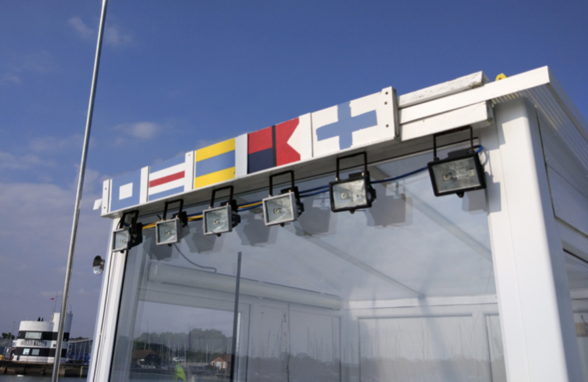
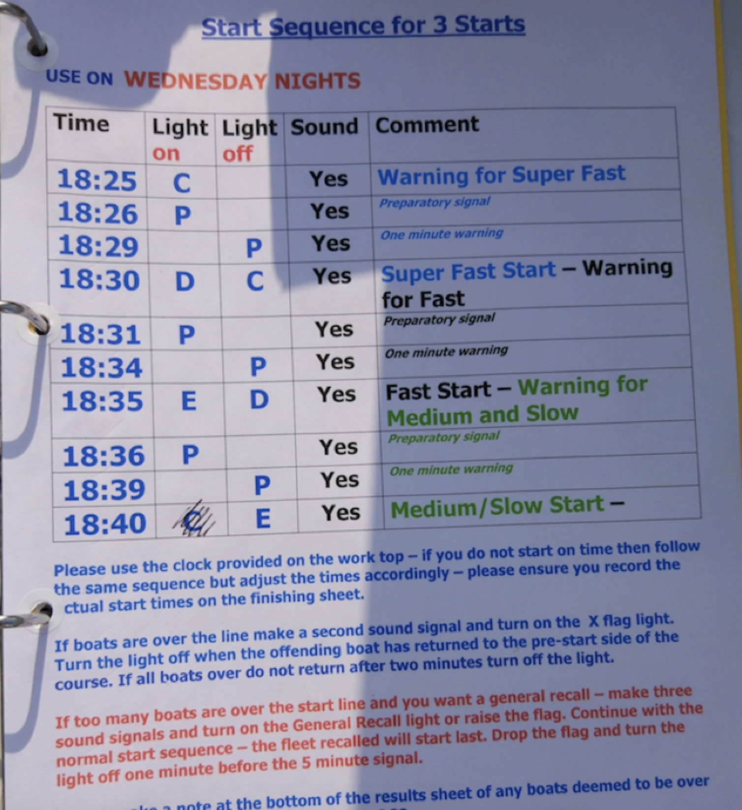
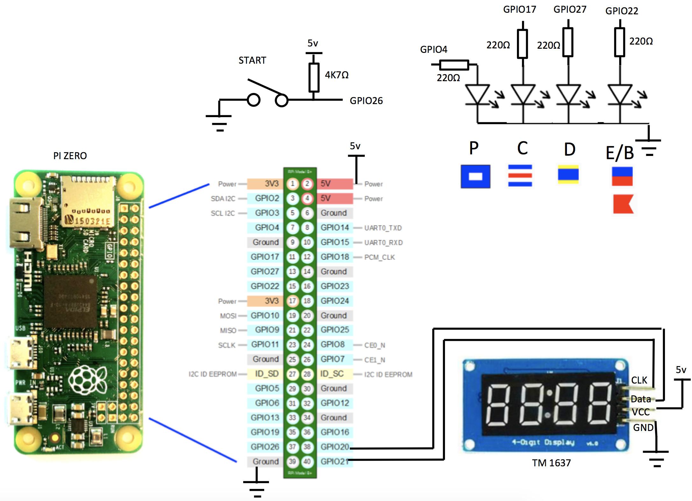
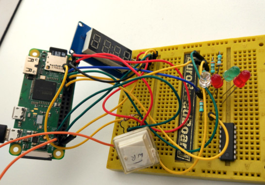
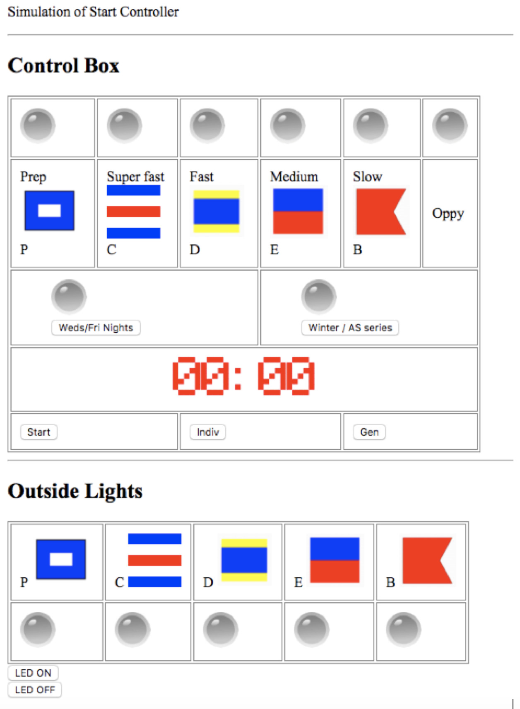

# Sailing Race Box Signal Controller Project

This project contains the design for a dinghy race start lighting system using Raspberry Pi.

## Description of Sailing Race Start Lights

When racing sailing boats, each race is started using a series of timed signals. The most common form is a count down sequence where each flag movement is accompanied by a sound signal:

5 minutes before start, raise class flag.
4 minutes before start, raise preparatory flag.
1 minute before start, lower preparatory flag.
0 minute lower class flag. Race is started.

If any boats are over the line at the start then we raise the X flag until all the relevant boats have returned and re-crossed the start line. 
If too many boats are over the start, then we issue a general recall with three sound signals and the general recall light.

The flag can be represented by a light that is adjacent to a picture of the flag as shown below.



In this figure, from left to right we have the following flags, P, C, D, E + B, X (4th light from the left represents both E and B flags).

A typical set of instructions for the race box operator is shown in the figure below:



On a Weds night there are three fleet starts. Super Fast, Fast and Slow.
The class flags are :
Super Fast = C
Fast = D
Slow = E

As can be seen in the above figure, Super Fast (C) starts when Fast (D) begins their 5 minute count-down. 


## Hardware



This project uses the Raspberry Pi Zero hardware, in particular the PiHut [Pi Zero](https://thepihut.com/products/raspberry-pi-zero-w  )  + [Essentials Kit](https://thepihut.com/products/raspberry-pi-zero-essential-kit) for £6.00 and a Pi Zero W for £9.30, plus any USB power supply.


A 4GB micro SD card is required for the Pi Zero, typically this is £4.

We also use a switch, 4 LEDs, a TM1637 4 digit LED display, and some resistors.

The TM1637 4 digit LED display is  less than £2 on eBay.
[300 assorted through hold LEDs](https://thepihut.com/products/ultimate-5mm-led-kit) are £6.00 on PiHut. User manual is [here](https://halckemy.s3.amazonaws.com/uploads/attachments/257650/user_guide_for_tm1637_4_digits_display_Yr8LQNg7dV.pdf).


Prototyping breadboard £3 on [PiHut](|https://thepihut.com/products/raspberry-pi-breadboard-half-size)


Pack of [220Ω through hole resistors](https://thepihut.com/products/adafruit-through-hole-resistors-220-ohm-5-1-4w-pack-of-25) £1


An image showing the prototype is shown below


Power is provided from a standard USB connection.

This is a prototype, with no sound transponder included. A production version will use relays to control much more powerful lights and a loud audio generator.

## Software

The Pi Zero has a micro SD memory card socket, typically a 4GB card will suffice.
 This has been loaded with the Raspbian Linux operating system, see [instructions here](https://www.raspberrypi.org/documentation/installation/installing-images/).


The Pi Zero has on-board WiFi so we will use this to connect to it. Before installing the SD Card we need to enter the settings for our WiFi network.
On the SD card, open the file:
`/etc/wpa_supplicant/wpa_supplicant.conf`

At the bottom of the file, add

```
network={    
 ssid="testing"     
 psk="testingPassword" 
 }
```
Now insert the SD Card into the Pi Zero and wait a minute for it to boot up (after plugging in the power).

I now log into my  network router to see what IP address has been assigned to the Pi Zero board.
So can log into the PI Zero with 

```
ssh pi@192.168.0.77
(password default is raspberry)
git clone ...(see details from repo above)
cd SailRaceBox
python go.py
```

This opens a bash shell, where we can go to the home directory  and git clone the remote repo to local, cd into SailRaceBox and run the pythion script as shown above.

If the circuit has been correctly wired up, we should see the LED characters and LED lights changing accordingly.

We can modify the script using the bash nano editor with
```
nano go.py
```

We can save modifications by pushing them to the remote repository
```
git add -modified filename-
git commit -m "commit message"
git push origin master
```

## Issues

See [Issues](https://github.com/NickThorne123/SailRaceBox/issues) and feel free to create a [pull request](https://guides.github.com/activities/hello-world/#pr) with contributions. Here's a [guide to collaborating](https://guides.github.com/activities/hello-world/) on Git..

## Web page controlled version

Note, an earlier version of this was created in HTML/CSS/Javascript/PHP.
This was created as an experiment to allow control from a smartphone connected to the built-in WiFi access point. It is considerably more complex to install requiring installation of the NGINX server with PHP. To save causing confusion, the code for this version is available on request, but not included in this repo. Some screen shots of this are shown below.


